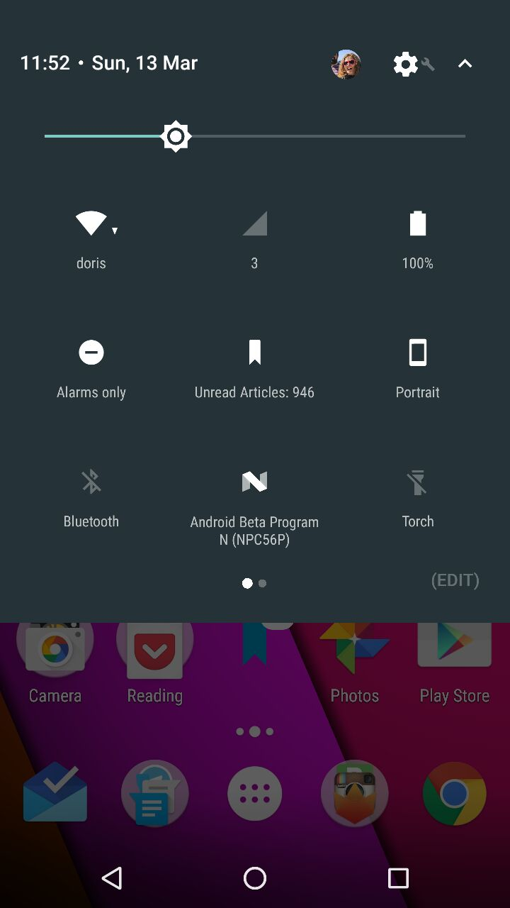

# Unread Articles Tile for Quick Settings

See the number of unread articles in your Pocket queue in the 'quick settings' area of Android N



Key parts to creating a quick settings tile:

 - Create a `Service` which is a subclass of `TileService`
 - Add it to the manifest, with a label and icon (which will be used as the default):
```xml
<service
    android:name=".feature.PocketQuickSettingsTileService"
    android:icon="@drawable/ic_bookmark"
    android:label="@string/unread_articles"
    android:permission="android.permission.BIND_QUICK_SETTINGS_TILE">
    <intent-filter>
        <action android:name="android.service.quicksettings.action.QS_TILE" />
    </intent-filter>
</service>
```
 - Implement methods in your `TileService` subclass which do what you want your tile to do - in this case we just update the number of unread articles in `onStartListening` but it's also possible to trigger something when the tile is clicked